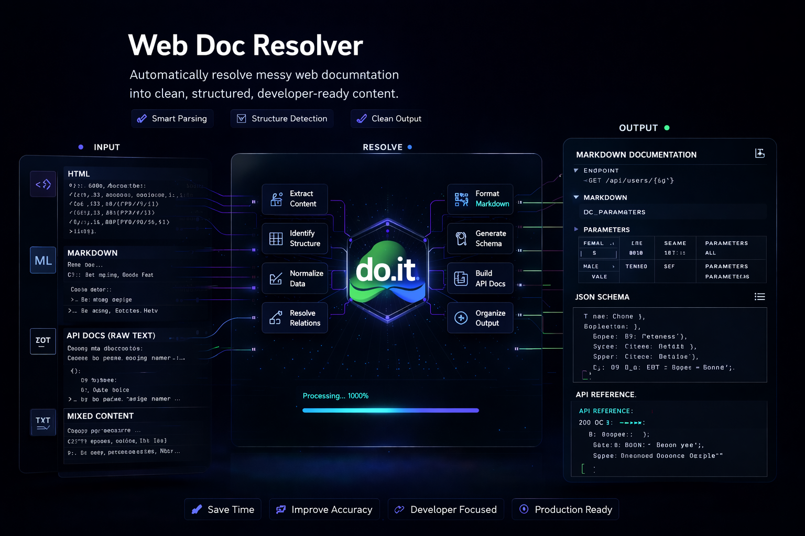

<div align="center">



# do-web-doc-resolver

**Resolve queries or URLs into compact, LLM-ready Markdown** — intelligent cascade routing across free and paid providers.  
Zero-config by default: works out of the box with no API keys.

[](https://github.com/d-oit/do-web-doc-resolver/actions)
[](https://github.com/d-oit/do-web-doc-resolver/releases)
[](LICENSE)
[](https://www.python.org/)
[](https://www.rust-lang.org/)
[](https://nextjs.org/)
[](CONTRIBUTING.md)

[**Live Demo**](https://web-eight-ivory-29.vercel.app) · [**Documentation**](docs/) · [**Report Bug**](../../issues) · [**Request Feature**](../../issues)

</div>

---

## Why do-web-doc-resolver?

- **Zero-key mode** — Works out of the box with no API keys; free providers are used by default
- **Intelligent cascade** — Routes through providers in priority order, stopping at the first successful result
- **Self-healing** — Circuit breakers and per-domain routing memory recover from failures automatically
- **LLM-optimized output** — Compact, deduplicated Markdown ready for direct injection into prompts
- **Three interfaces** — Python library, Rust CLI, and Next.js Web UI — one core, any workflow

---

## Table of Contents

- [Quick Start](#quick-start)
- [Architecture](#architecture)
- [Features](#features)
- [Installation](#installation)
- [Configuration](#configuration)
- [Usage](#usage)
- [Agent Skills](#agent-skills)
- [Data Layer](#data-layer)
- [Testing](#testing)
- [Repository Structure](#repository-structure)
- [Contributing](#contributing)
- [License](#license)

---

## Quick Start

```bash
# Clone and install (no API keys needed)
git clone https://github.com/d-oit/do-web-doc-resolver.git
cd do-web-doc-resolver
pip install -r requirements.txt

# Resolve a URL
python -m scripts.cli "https://docs.example.com"

# Resolve a search query (uses free providers)
python -m scripts.cli "your search query"
```

Or try the **[live demo →](https://web-eight-ivory-29.vercel.app)**

---

## Architecture

### Resolution Cascade

```text
Input (URL or query)
  │
  ▼
┌────────────────────────────────────────────────┐
│ 1. Semantic Cache             (free, instant)  │
├────────────────────────────────────────────────┤
│ 2. Free Providers             (no key needed)  │
├────────────────────────────────────────────────┤
│ 3. Paid Providers             (API key req.)   │
├────────────────────────────────────────────────┤
│ N. Fallback                   (free)           │
└────────────────────────────────────────────────┘
```

Query providers: Semantic Cache → Exa MCP → Exa SDK → Tavily → Serper → DuckDuckGo → Mistral  
URL providers: Semantic Cache → llms.txt → Jina Reader → Firecrawl → Direct HTTP → Mistral Browser → DuckDuckGo

---

## Features

| Feature | Description |
|---|---|
| **Cascade Routing** | Automatic provider fallback with configurable priority order |
| **Semantic Cache** | In-memory similarity lookup with configurable TTL per provider |
| **Circuit Breakers** | Per-provider failure detection with automatic recovery |
| **Routing Memory** | Remembers which providers succeed for each domain |
| **Quality Scoring** | Ranks results by content density and relevance |
| **Multi-interface** | Python API, Rust CLI (`do-wdr`), and Next.js Web UI |
| **Zero-config** | Works without API keys using free providers by default |
| **LLM-ready output** | Compact Markdown optimized for prompt injection |

---

## Installation

### Python (library + CLI)

Requires Python 3.10 or higher.

```bash
git clone https://github.com/d-oit/do-web-doc-resolver.git
cd do-web-doc-resolver
pip install -r requirements.txt
```

### Rust CLI (`do-wdr`)

```bash
cd cli
cargo build --release
# Binary: cli/target/release/do-wdr
```

### Web UI (Next.js)

```bash
cd web
npm install --legacy-peer-deps
npm run dev
# Open http://localhost:3000
```

---

## Configuration

All API keys are **optional**. The tool works with zero configuration using free providers.

| Variable | Provider | Required | Notes |
|---|---|---|---|
| `EXA_API_KEY` | Exa SDK | No | Enables Exa search with highlights |
| `TAVILY_API_KEY` | Tavily Search | No | Enables broad web search |
| `SERPER_API_KEY` | Serper (Google) | No | Enables Google search |
| `FIRECRAWL_API_KEY` | Firecrawl | No | Enables deep content extraction |
| `MISTRAL_API_KEY` | Mistral AI | No | Enables AI-powered search/browse |

```bash
# Linux/macOS
export EXA_API_KEY="your-key"

# Windows PowerShell
$env:EXA_API_KEY="your-key"
```

Configuration file: [`config.toml`](config.toml) — routing thresholds, cache TTLs, rate limits.

---

## Usage

### Python API

```python
from scripts.resolve import resolve

# Resolve a URL
result = resolve("https://docs.python.org/3/library/json.html")
print(result["content"])

# Resolve a search query
result = resolve("Python json module documentation")
print(result["content"])
```

### Python CLI

```bash
python -m scripts.cli "your search query"
python -m scripts.cli "https://example.com"
```

### Rust CLI (`do-wdr`)

```bash
./cli/target/release/do-wdr resolve "https://docs.example.com"
./cli/target/release/do-wdr resolve "your search query"
```

### Web UI

```bash
cd web && npm run dev
# Open http://localhost:3000 and enter a URL or query
```

---

## Agent Skills

The resolver ships as a skill for AI agents under `.agents/skills/`. It provides a self-contained `SKILL.md` with references, tests, and a portable Python module.

| Skill | Interface | Purpose |
|---|---|---|
| [`do-web-doc-resolver`](.agents/skills/do-web-doc-resolver/) | Python | Full cascade resolver — importable module or CLI |
| [`do-wdr-cli`](.agents/skills/do-wdr-cli/) | Rust | Compiled `do-wdr` binary for fast resolution |

### Using the Core Skill

```bash
# As a CLI (from project root)
python3 -m scripts.cli "https://docs.example.com"

# As a Python module
from scripts.resolve import resolve
result = resolve("your search query")
print(result["content"])

# Via the Rust CLI
cd cli && cargo build --release
./target/release/do-wdr resolve "https://docs.example.com"
```

---

## Data Layer

The resolver uses two complementary storage systems — both in-memory by default, with optional persistent backends.

### Semantic Cache

Provides similarity-based caching using local embeddings. Identifies semantically equivalent queries (not just exact matches) and returns cached results instantly.

| Component | Detail |
|---|---|
| **Engine** | SQLite + [sqlite-vec](https://github.com/asg017/sqlite-vec) vector extension |
| **Embeddings** | `all-MiniLM-L6-v2` via sentence-transformers (~80MB, runs locally) |
| **Storage** | `~/.cache/do-web-doc-resolver/semantic/semantic_cache.db` |
| **Similarity** | Cosine distance, threshold `0.85` (configurable) |
| **Eviction** | LRU with max `10,000` entries (configurable) |
| **TTL** | Per-provider, 1–24 hours (see `config.toml`) |

```bash
# Optional: install sqlite-vec for high-performance vector search
pip install sqlite-vec
```

**Configuration:**

| Variable | Default | Description |
|---|---|---|
| `DO_WDR_SEMANTIC_CACHE` | `1` | Set to `0` to disable |
| `DO_WDR_CACHE_THRESHOLD` | `0.85` | Minimum similarity for cache hits |
| `DO_WDR_CACHE_MAX_ENTRIES` | `10000` | Max entries before LRU eviction |

### Routing Memory

Learns which providers work best for each domain. Ranks providers by success rate, quality score, latency, and recency — so repeated requests to the same domain go to the fastest, most reliable provider first.

| Component | Detail |
|---|---|
| **Storage** | In-memory (`defaultdict`), thread-safe |
| **Ranking** | Weighted: success rate × quality × recency / latency |
| **Decay** | Recency factor decays over 7 days |
| **Base score** | `0.5` for unknown provider/domain pairs |

### Circuit Breakers

Protects against cascading failures. When a provider fails 3 consecutive times, it is skipped for 5 minutes before retry.

| Setting | Value |
|---|---|
| Failure threshold | 3 consecutive failures |
| Cooldown | 300 seconds (5 minutes) |
| Reset | Successful call resets failure count |

### State Management

All shared state is managed via a singleton `ResolverState` object (`scripts/state.py`):

```python
from scripts.state import get_state

state = get_state()
# state.circuit_breakers  — CircuitBreakerRegistry
# state.routing_memory    — RoutingMemory (per-domain learning)
# state.semantic_cache    — SemanticCache (sqlite-vec)
```

---

## Testing

### Python Suite

```bash
python -m pytest tests/ -v -m "not live"
```

### Rust Suite

```bash
cd cli && cargo test
```

### Web UI Suite

```bash
cd web && npx playwright test --project=desktop
```

### Full Quality Gate

```bash
./scripts/quality_gate.sh
```

---

## Repository Structure

```text
do-web-doc-resolver/
├── scripts/                 # Python resolver core
│   ├── resolve.py           # Main entry point
│   ├── _cascade.py          # Cascade routing engine
│   ├── _query_resolve.py    # Query resolution providers
│   ├── _url_resolve.py      # URL resolution providers
│   ├── semantic_cache.py    # SQLite-vec semantic cache
│   ├── routing_memory.py    # Per-domain provider learning
│   ├── circuit_breaker.py   # Provider failure protection
│   ├── state.py             # Shared resolver state singleton
│   └── quality.py           # Content quality scoring
├── cli/                     # Rust CLI (do-wdr)
│   └── src/
├── web/                     # Next.js Web UI
│   └── app/
├── tests/                   # Python test suite
├── .agents/skills/          # Agent skill definitions
│   ├── do-web-doc-resolver/ # Core resolver skill
│   ├── do-wdr-cli/          # Rust CLI skill
│   ├── do-wdr-release/      # Release management
│   └── ...                  # 11 skills total
├── docs/                    # Project documentation
├── agents-docs/             # Agent-specific reference
├── assets/                  # Logo, screenshots, visual assets
├── config.toml              # Routing, cache, and rate config
├── CONTRIBUTING.md          # Contribution guidelines
├── LICENSE                  # MIT License
└── README.md                # This file
```

---

## Contributing

Contributions are welcome!

1. Fork the repository
2. Create a feature branch (`git checkout -b feat/my-feature`)
3. Add tests for new functionality
4. Run the quality gate: `./scripts/quality_gate.sh`
5. Submit a pull request

See [CONTRIBUTING.md](CONTRIBUTING.md) for detailed guidelines (Python linting, Rust clippy, Web typecheck).

---

## License

MIT License — see [LICENSE](LICENSE) for details.
